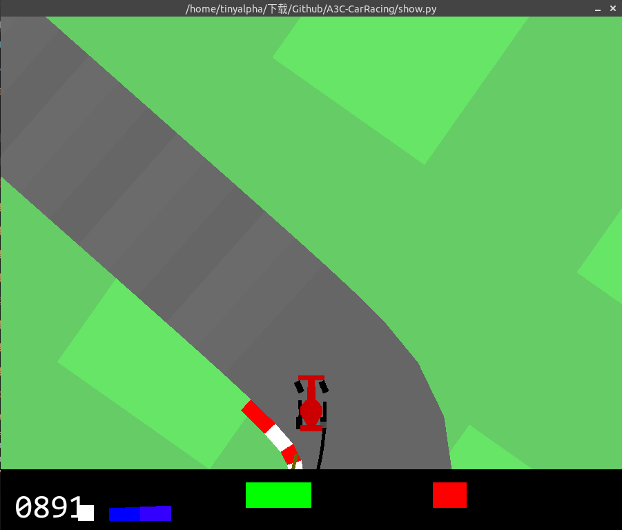
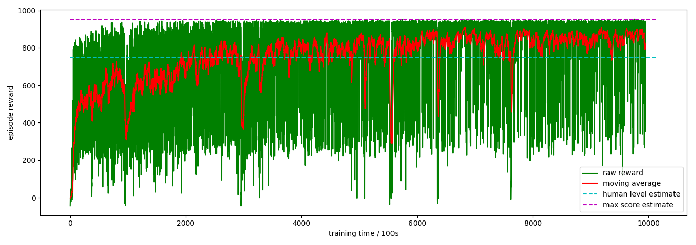

# A3C-CarRacing
> An agent trained using A3C to play openai gym CarRacing-v0, which can get as high as 900+ score



### how to use

* run `show.py` to make AI whose weights are stored in bak play the game
* run `main.py` to train a AI yourself
* you can change hyperparameter in `constants.py`

### result

* I have trained the model on 4 azure vCPUs one week and store the weights and logs in `bak` 
* the agent can get average 870+ scores
* the rewards curve is shown below, where I estimate human level and max score by 750 and 950 for compare



* [There](bak/demo.mp4) is a demo video in `bak`

### details

* I have define 9 actions for AI, which are:

  |     action     |    value     |
  | :------------: | :----------: |
  |      left      |  [-1, 0, 0]  |
  |     right      |  [1, 0, 0]   |
  |    accerate    |  [0, 1, 0]   |
  |     brake      | [0, 0, 0.8]  |
  | accerate_left  | [-1, 0.5, 0] |
  | accerate_right | [1, 0.5, 0]  |
  |   brake_left   | [-1, 0, 0.4] |
  |  brake_right   | [1, 0, 0.4]  |
  |   do nothing   |  [0, 0, 0]   |

  More actions can make the agent gain higher score and drive more smoothly.

* different from other related repositories, I sample action by probability even when testing instead of using `argmax`, because I find it can make the agent do better. I argue that it's because when considering more than one frames and average the actions, the agent actually can do more continuous action.

### dependency

* python 3.x

* pytorch 0.4.0

* pyvirtualdisplay (if you want to train the model on a server which don't have a monitor)

* To get more suitable window size, I modify `car_racing.py` in installation folder (for example `site-packages\gym\envs\box2d`), which is

  ```python
  line 46: WINDOW_W = 1200  ->  WINDOW_W = 900 
  line 47: WINDOW_H = 1000  ->  WINDOW_H = 750
  ```

  you are suggested to do the same, otherwise the agent may can't adapt to the scale change and get lower score

### reference

* https://github.com/ikostrikov/pytorch-a3c (The main code is based on this repository, thanks the author very much)
* https://github.com/oguzelibol/CarRacingA3C
* https://github.com/PDillis/Experiment-CarRacing
* https://github.com/hchkaiban/CarRacingRL_DDQN
* https://gym.openai.com/